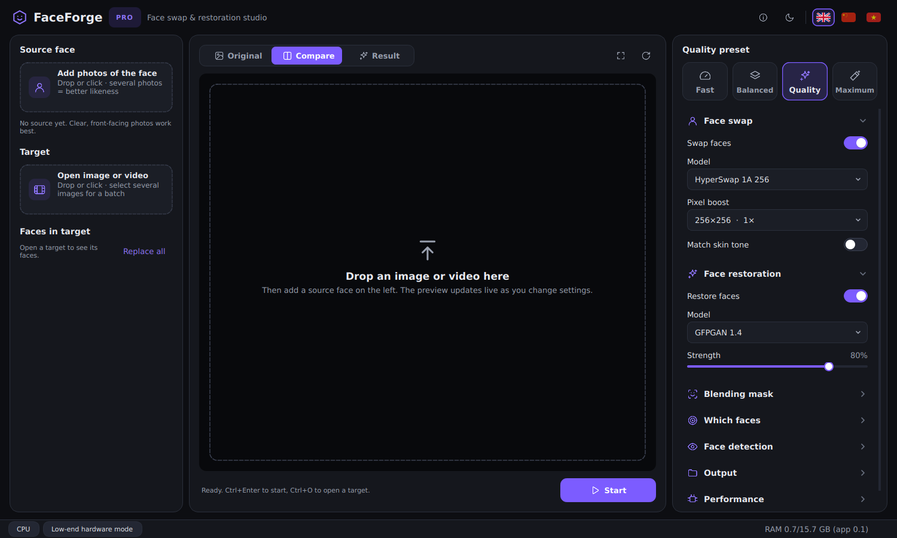

# FaceForge

**AI face swap and face restoration studio for Windows, macOS and Linux. Runs offline on your own GPU.**


-green?logo=qt)




## Editions

FaceForge comes in two editions built from the same code.

| | **FaceForge Pro** | **FaceForge Lite** |
|---|---|---|
| Goal | Best possible output quality | Smooth on low-end laptops |
| Platforms | Windows (CUDA), macOS (Apple Silicon), Linux (CUDA) | Windows (DirectML) |
| Default preset | Maximum (high-end GPU) or Quality | Balanced (Fast with 8 GB RAM or less) |
| Default swap | HyperSwap 256 with 2×2 pixel boost | InSwapper 128 |
| Masks | Occlusion + face parsing | Soft box mask |
| Recommended hardware | NVIDIA RTX 20xx+ with 8 GB+ VRAM, or Apple M1 Pro+; 16 GB+ RAM | Any DirectX 12 GPU (e.g. GTX 1050 4 GB), 8–16 GB RAM, 4-core CPU |

Both editions can reach every setting. The edition only decides the defaults.
Pro shows a warning on machines below its requirements. Lite's DirectML
backend runs on NVIDIA, AMD and Intel GPUs without installing CUDA.

## Features

- **Face swap**: HyperSwap 1A/1B/1C (256 px), the newest open model, with
  its own blend mask. InSwapper 128 (FP32/FP16) for speed. **Pixel boost**
  renders faces at 2–4× the model resolution.
- **Face restoration**: GFPGAN 1.4, CodeFormer (fidelity control), GPEN-BFR
  256/512, RestoreFormer++.
- **Masks**: soft box with padding, XSeg occlusion (hands, hair, glasses stay
  in front), BiSeNet face parsing, skin-tone matching.
- **Face selection**: all faces, the largest face, or one person picked from
  the target. That person is followed through the whole video.
- **Video**:
  - Frames stream straight into FFmpeg, with no temporary images.
  - Hardware encoding (NVENC / Quick Sync / AMF / VideoToolbox).
  - The original audio is kept.
  - **Resumable**: stop or crash at any point and the next run continues
    from the last finished segment.
- **Batch**: select several images at once.
- **Live preview**: before/after compare slider, zoom and pan. The preview
  updates as you change settings.
- **One-click presets**: Fast, Balanced, Quality, Maximum.
- **Automatic hardware tuning**:
  - Detects RAM, VRAM and GPU generation.
  - Uses FP16 only where it is actually faster.
  - Never uses CUDA 13 on GPUs it doesn't support.
  - Caps the models kept in memory so 4 GB GPUs don't run out.
- **Model manager**: downloads exactly what you need, with resume and size check.
- **Interface**:
  - Language switcher with English, 中文 and Tiếng Việt flags.
  - Dark and light themes.
  - Smooth animated controls.

## Download

Ready-to-run builds come from GitHub Actions (**Actions → Build → Artifacts**),
or from **Releases** for tagged versions:

| File | For |
|---|---|
| `FaceForge-Lite-Windows-x64.zip` | Windows laptops / older GPUs (DirectML) |
| `FaceForge-Pro-Windows-x64-CUDA.7z` | Windows + NVIDIA RTX 20xx or newer (open with 7-Zip) |
| `FaceForge-Pro-macOS-AppleSilicon.dmg` | macOS 12+ on Apple Silicon |
| `FaceForge-Pro-Linux-x64-CUDA.tar.xz` | Linux + NVIDIA RTX 20xx or newer |

The CUDA builds include about 2 GB of NVIDIA libraries. If an archive would
be larger than GitHub's 2 GB file limit, it is split into numbered parts
(`.7z.001`, `.002`… or `.tar.xz.000`, `.001`…). Download all parts:
7-Zip opens the first `.7z` part directly, and on Linux run
`cat *.tar.xz.* | tar -xJ`.

To run a build:

- **Windows**: unzip and run `FaceForge Lite.exe` / `FaceForge Pro.exe`.
  - On laptops with two GPUs, go to *Settings → System → Display → Graphics*
    and set the exe to **High performance**. This makes DirectML use the
    NVIDIA GPU.
- **macOS**: the app is not notarized. The first time, right-click it → **Open**.
- **Linux**: extract it and run `./FaceForge\ Pro/FaceForge\ Pro`.

The models (0.7–1.1 GB per preset) download automatically on first use. See
[MODELS.md](MODELS.md).

## Run from source

```bash
git clone https://github.com/chenboguang7976/FaceForge.git
cd FaceForge
python -m venv venv
venv\Scripts\activate          # Windows
# source venv/bin/activate     # macOS / Linux

# Pick ONE backend:
pip install -r requirements/directml.txt   # Windows, any GPU (GTX 10xx, AMD, Intel)
pip install -r requirements/cuda.txt       # NVIDIA RTX 20xx+ (CUDA 13, fastest)
pip install -r requirements/cuda12.txt     # NVIDIA GTX 10xx/16xx via CUDA 12
pip install -r requirements/cpu.txt        # CPU only; macOS (includes CoreML)

python run.py                   # add --edition lite or --edition pro to force an edition
```

CUDA and cuDNN are installed as pip packages, so no CUDA Toolkit install is
needed. An existing toolkit such as CUDA 11.8 can stay installed and is not
used.

**GTX 10xx (Pascal) note:** CUDA 13, which onnxruntime-gpu 1.27+ uses,
dropped Pascal. Use `directml.txt` or `cuda12.txt` on those cards.

## Build the apps yourself

```bash
pip install -r requirements/<backend>.txt -r requirements/build.txt
python packaging/make_icon.py
FACEFORGE_EDITION=lite pyinstaller packaging/faceforge.spec --noconfirm   # or pro
"dist/FaceForge Lite/FaceForge Lite" --selftest                           # smoke test
```

`.github/workflows/build.yml` builds all four packages, runs the tests and a
self-test of each frozen app. Pushing a `v*` tag publishes a release.

## Project structure

```
FaceForge/
├── run.py                       # entry point (--debug, --edition, --selftest)
├── faceforge/
│   ├── edition.py               # Pro / Lite
│   ├── config.py                # settings.json (atomic save, migration)
│   ├── core/
│   │   ├── hardware.py          # RAM/VRAM/GPU detection, device selection
│   │   ├── presets.py           # Fast / Balanced / Quality / Maximum
│   │   ├── models_data.py       # model registry (URLs, sizes)
│   │   ├── models_processor.py  # ONNX Runtime sessions, LRU cache, fallbacks
│   │   ├── pipeline.py          # detect → select → swap → mask → paste → restore
│   │   └── video_processor.py   # FFmpeg pipeline, segments, resume, audio
│   ├── processors/              # detector, recognizer, swapper, enhancer, masks
│   ├── helpers/                 # paths, logging, image I/O, ffmpeg, downloader
│   └── ui/                      # Qt UI: main window, settings panel, i18n, theme, widgets
├── packaging/                   # PyInstaller spec, icon
├── requirements/                # one file per inference backend
└── tests/                       # pytest suite (unit + optional end-to-end)
```

Run the tests with `pytest`. For the end-to-end test, set
`FACEFORGE_TEST_MODELS` (a models folder) and `FACEFORGE_TEST_IMAGE`.

## Hướng dẫn nhanh (Tiếng Việt)

1. Tải bản phù hợp:
   - Máy yếu hoặc GPU cũ (ví dụ GTX 1050): **FaceForge Lite**.
   - Máy mạnh (RTX, Apple Silicon): **FaceForge Pro**.
2. Mở app, bấm lá cờ 🇻🇳 ở góc trên bên phải để chuyển sang tiếng Việt.
3. Kéo ảnh khuôn mặt nguồn vào ô bên trái, rồi kéo ảnh hoặc video đích vào khung giữa.
4. Chọn mức chất lượng (Nhanh / Cân bằng / Chất lượng / Tối đa) và xem trước ngay.
5. Bấm **Bắt đầu**. Kết quả được lưu trong thư mục `output`.
   - Video đang làm dở có thể tiếp tục ở lần sau.

## Responsible use

Only process faces of people who have given their consent. Do not use
FaceForge to deceive, harass, impersonate or create non-consensual content,
and follow the laws where you live. You are responsible for what you create.

## Credits

[InsightFace](https://github.com/deepinsight/insightface) ·
[FaceFusion](https://github.com/facefusion/facefusion) (model assets) ·
[GFPGAN](https://github.com/TencentARC/GFPGAN) ·
[CodeFormer](https://github.com/sczhou/CodeFormer) ·
[GPEN](https://github.com/yangxy/GPEN) ·
[VisoMaster](https://github.com/visomaster/visomaster) ·
[Rope](https://github.com/Hillobar/Rope)

Licensed under the GNU GPL v3.
